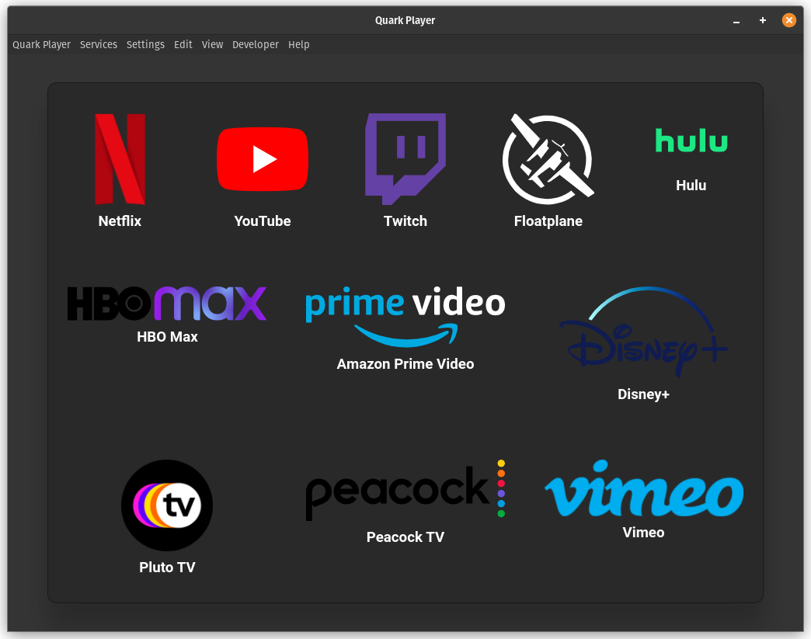

<p align="center">
  
</p>

<div align="center">
  <h1>Quark Player</h1>
  An Electron based web video services player, supporting Netflix, Youtube, Twitch, Floatplane, Hulu, Amazon Prime Video and More!
  <br/>
  This is a fork and successor of <a target="_blank" rel="noopener" href="https://github.com/oscartbeaumont/ElectronPlayer">ElectronPlayer</a>.
</div>

# Features

 - Multiple streaming services supported (You can use JSON configuration to add others)
 - AdBlocker (provided by Cliqz)
 - Always On Top Window
 - Set Startup Page (Any service, or remember last opened page)
 - Frameless Window
 - Rough Picture in Picture Support (Floating Window, Above all Window, and Fullscreen)
 - Full Screen Window on Startup
 - Alt+Left and Alt+Right to navigate back/forward in page
 - Custom Electron top bar menu with multiple functions.
 - Right click menu with functions similar to Chromium.

## Screenshot


_The app's main menu interface_

# Installation

## Windows

There are .exe installers, and portable .zips in [Releases](https://github.com/Alex313031/quarkplayer/releases).

*__NOTE:__ The last version for Windows 7/8/8.1 is [v3.3.5](https://github.com/Alex313031/quark-player/releases/tag/v3.3.5)*

## Linux

There are .deb installers, .AppImages, and portable .zips in [Releases](https://github.com/Alex313031/quarkplayer/releases).

## MacOS

Working on it. Need a Mac to build.

# Developing/Building

Requires nodejs 14, or 16. It is reccomended to use [nvm](https://github.com/nvm-sh/nvm) for installing/managing node versions.
Yarn can also be used.

```bash
git clone https://github.com/Alex313031/quarkplayer.git
cd quarkplayer
nvm install # Only use if you are using nvm
npm install # Install needed npm deps
npm run start # Run app in dev mode
npm run dist # To make installation packages
```

## Documentation

See [Docs](https://github.com/Alex313031/quarkplayer/tree/master/docs#readme)

## TODO

See [TODO.txt](TODO.txt)

## Contributors

A huge thanks to the following people for contributing and helping shape this project.

- [Oscar Beaumont](https://github.com/oscartbeaumont)
- [Austin Kregel](https://github.com/austinkregel)
- [Rasmus Lindroth](https://github.com/RasmusLindroth)
- [Scrumplex](https://github.com/Scrumplex)

## Analytics

 - Removed Analytics!
~~This application has analytics built in which is used to help the developers make a better product. [Simple Analytics](https://simpleanalytics.com) was chosen due to their strong views on keeping users private. They are also GDPR, CCPA, & PECR compliant. The data collected by the app can be viewed by anyone [here](https://simpleanalytics.com/electronplayer.otbeaumont.me).~~
